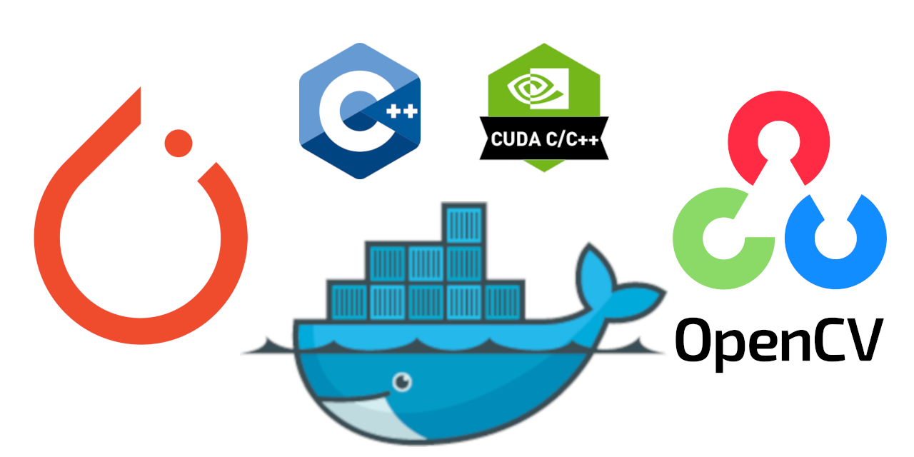

# Docker toolchain for building and running OpenCV and Pytorch C++ projects with CUDA support in CLion

<br>

## Features
The main feature to use docker container for development is to encapsulate all dependencies in a container. This allows to build and run the code on any host system without the need to install dependencies (or only a minimal installation is required)
- [x] Build all dependencies encapsulated in a Docker container (minimal host dependencies)
- [x] Use local NVIDIA GPU in docker
- [x] Use Pytorch with CUDA support 
- [x] Use OpenCV with local devives (Webcam, screen output) in docker 

### Details: 
- NVIDIA CUDA 12.2.2
- NVIDIA cuDNN8
- CMAKE 3.28.3
- GCC 12
- LLVM/CLang 17
- Ninja 1.11.1
- Pytorch (libtorch) 2.3.x
- OpenCV 4.x

## Host system setup
- My host OS is TUXEDO-OS, based on Ubuntu.
- This example is to be used with JetBrains CLion, so you need to have it installed.
- I used NVIDIA RTX-4070 GPU, but it should work with other NVIDIA GPU with CUDA support. 

## Installation
### Docker
First, install Docker on your host system. Use the common instructions from web, like [Install Docker Engine on Ubuntu](https://docs.docker.com/engine/install/ubuntu/) or [How To Install and Use Docker on Ubuntu 22.04](https://www.digitalocean.com/community/tutorials/how-to-install-and-use-docker-on-ubuntu-22-04).

> **Note:** Don't forget to add your user to the docker group to avoid using sudo for docker commands:
```bash
sudo usermod -aG docker $USER
```
To apply the new group membership, log out of the server and back in, or type the following:
```bash
su - $USER
```
Check docker availability:
```bash
docker --version
```
You should see the version of docker installed, like this:
```bash
Docker version 25.0.4, build 1a576c5
```

### NVIDIA Container Toolkit 
1. Add the NVIDIA repository to the system
```bash
  distribution=$(. /etc/os-release;echo $ID$VERSION_ID)
  curl -s -L https://nvidia.github.io/nvidia-docker/gpgkey | sudo apt-key add -
  curl -s -L https://nvidia.github.io/nvidia-docker/$distribution/nvidia-docker.list | sudo tee /etc/apt/sources.list.d/nvidia-docker.list
  sudo apt update
  ```
2. Install actual driver if not already installed
```bash
sudo apt install -y nvidia-driver-535
```
3. Install the NVIDIA Container Toolkit
```bash
sudo apt install -y nvidia-container-toolkit
```
4. Restart system

5. Check NVIDIA GPU is available
```bash
nvidia-smi
```
You should see the output of the NVIDIA System Management Interface, like this:
```bash
+---------------------------------------------------------------------------------------+
| NVIDIA-SMI 535.146.02             Driver Version: 535.146.02   CUDA Version: 12.2     |
|-----------------------------------------+----------------------+----------------------+
| GPU  Name                 Persistence-M | Bus-Id        Disp.A | Volatile Uncorr. ECC |
| Fan  Temp   Perf          Pwr:Usage/Cap |         Memory-Usage | GPU-Util  Compute M. |
|                                         |                      |               MIG M. |
|=========================================+======================+======================|
|   0  NVIDIA GeForce RTX 4070 ...    Off | 00000000:01:00.0 Off |                  N/A |
| N/A   53C    P0              29W /  65W |   1185MiB /  8188MiB |     49%      Default |
|                                         |                      |                  N/A |
+-----------------------------------------+----------------------+----------------------+
```

### Clone the repository
Go to the directory where you want to clone the repository and run the following command:
```bash
git clone https://github.com/sleepingwithshoes/torchopencv.git
cd torchopencv
```
## Build docker image
To build the docker image, run the following command (**Please note** that build process will take some time, depending on the performance of your host system.)
```bash
docker build --no-cache --build-arg UID=$(id -u) -t cliontorch -f docker/Dockerfile .
```
## Setup toolchain in CLion
1. Open Clion and open the project folder (where you cloned the repository)
2. An overlay window should appear to configure the cmake profile. If not, go to `File -> Settings -> Build, Execution, Deployment -> CMake` and add a new profile.
3. Add a new profile by clicking the `+`.
   <br> 
4. Set a `Name` like Debug-docker, select `Build type` Debug.
5. Select `Manage toolchains...` behind `Toolchain:` to add a new toolchain. The following window should appear:
6. Click the `+` button and select `Docker` from the dropdown menu. 
7. Set a `Name` (like Docker-torch-opencv) and select the docker `Image` you built before (`cliontorch:latest`).
   <br>
8. Modify the `Containter Settings` to select `Gearwheel`
   - Add the following volumes:
     - `/dev:/dev`
     - `/tmp/.X11-unix:/tmp/.X11-unix`
   - Set the `Environment` variable:
      - `DISPLAY` with value `:0`
   - Add the following run options:
     - `--gpus all`
     - `--privileged
  <br>
9. Click `OK` through all windows to save the settings.

Now you have set up the toolchain to build and run the project in a docker container.
<br>

## Conclusion
Perhaps this little repository helps you to develop C++ projects with Pytorch and OpenCV in a docker container.<br>
**Have fun and happy coding!** 

